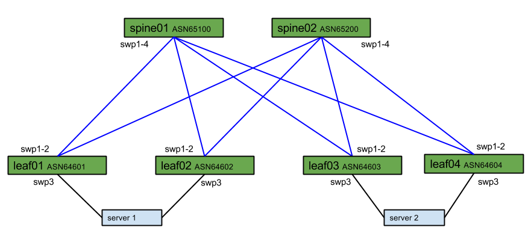

# VLAN Free Container Networking

## Introduction
This demo will show how BGP on a server can be used to provide network redundancy for physical Docker hosts without mLAG or VLANs. This scenario will work both with and without VxLAN overlays.

## Network Diagram:
The topology for this demo can be seen here.

[//]: # " Diagram located at: https://docs.google.com/drawings/d/1wwD6VD8Kdit1tU6t62mhcS0uPWtPYYm7zUpcjxGbcLY/edit"
